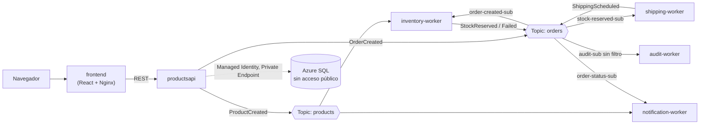

# Azure Microservices Demo

Arquitectura de microservicios event-driven en Azure Container Apps, con
networking privado (VNet + Private Endpoint), autoscaling basado en eventos
(KEDA), y un pipeline de pedidos encadenado que simula una bodega/e-commerce.

Construido como proyecto de aprendizaje práctico de Azure — ver
[`docs/AZURE-LEARNING-GUIDE.md`](docs/AZURE-LEARNING-GUIDE.md) para la guía
completa paso a paso, incluyendo los errores reales encontrados en el camino
y cómo se resolvieron.

## Arquitectura



Todos los servicios corren como **Azure Container Apps** dentro de la misma
VNet, autenticándose entre sí y hacia SQL vía **Managed Identity** (sin
passwords ni connection strings con secretos hardcodeados).

## Servicios (`src/`)

| Servicio | Rol |
|---|---|
| `ProductsApi` | API REST (.NET) — catálogo de productos, pedidos, dashboard de estado |
| `InventoryWorker` | Revisa/decrementa stock real al recibir un pedido |
| `ShippingWorker` | Simula preparar el envío una vez reservado el stock |
| `NotificationWorker` | Notifica éxito/fallo del pedido (sin acceso a base de datos) |
| `AuditWorker` | Registra cada evento del pipeline en una tabla de auditoría (sin filtro, recibe todo) |
| `frontend` | Dashboard en React — productos, pedidos, línea de tiempo, estado de la arquitectura en vivo |

## Prerequisitos

- [Azure CLI](https://learn.microsoft.com/cli/azure/install-azure-cli) (`az`), con sesión iniciada (`az login`)
- [.NET SDK 10](https://dotnet.microsoft.com/download)
- [Docker](https://docs.docker.com/get-docker/) (para construir/subir las imágenes)
- [Node.js](https://nodejs.org/) 20+ (para el frontend)
- Solo si vas a usar el pipeline de CI/CD: [GitHub CLI](https://cli.github.com/) (`gh`), con sesión iniciada (`gh auth login`)

## Para cualquier miembro del equipo: desplegar con TU PROPIA cuenta de Azure

Este repo está pensado para que cualquiera lo clone y lo recree en su propia
suscripción, sin editar nada a mano:

```bash
az login          # con tu propia cuenta de Azure
cd scripts
./01-create-network.sh   # este y los siguientes generan nombres únicos automáticamente
```

`scripts/00-vars.sh` (que los demás scripts cargan automáticamente) genera
un **sufijo aleatorio único** la primera vez que corres cualquier script, y
lo guarda en `scripts/.suffix` (no se sube a git) — así los nombres que
deben ser únicos globalmente en Azure (ACR, SQL Server, Service Bus) nunca
chocan entre distintas personas usando este mismo repo, sin que nadie tenga
que editar nombres manualmente.

Los scripts están numerados en el orden en que se deben correr:

```bash
./02-create-acr-and-env.sh
./03-create-service-bus.sh
./04-create-sql.sh              # sigue las instrucciones que imprime al final (paso manual de esquema SQL)
./05-build-and-push-images.sh
./06-deploy-container-apps.sh
./07-configure-rbac-and-scaling.sh
```

Después de `04-create-sql.sh`, corre manualmente `scripts/sql/01-schema.sql`
y `scripts/sql/02-grant-managed-identities.sql` en el Query Editor del portal
(con el acceso público temporalmente habilitado, como indica el script).

Para generar carga de prueba y observar el autoscaling:
```bash
./scripts/load-test.sh 50
```

### Correr el frontend en modo desarrollo (sin Docker)

Útil para iterar rápido en la UI sin reconstruir la imagen cada vez:
```bash
cd src/frontend
npm install
echo "VITE_API_URL=https://<fqdn-de-tu-productsapi>" > .env
npm run dev
```
El FQDN de `productsapi` lo imprime `06-deploy-container-apps.sh` al terminar (o `az containerapp show --name productsapi --resource-group rg-microservices --query properties.configuration.ingress.fqdn -o tsv`).

## Infraestructura como código (`infra/`)

Ver [`infra/README.md`](infra/README.md) — incluye `scripts/setup-github-oidc.sh`,
que conecta el pipeline de CI/CD (GitHub Actions) a tu propia cuenta de Azure
en un solo paso, sin copiar/pegar comandos ni secretos manuales.

## Documentación

- [`docs/AZURE-LEARNING-GUIDE.md`](docs/AZURE-LEARNING-GUIDE.md) — guía completa, incluye teoría de networking, RBAC, KEDA, troubleshooting real.
- [`docs/AZ-900-STUDY-PATH.md`](docs/AZ-900-STUDY-PATH.md) — path de estudio para el examen AZ-900, mapeando qué de este proyecto ya cubre el temario y qué falta repasar de forma puramente conceptual.
