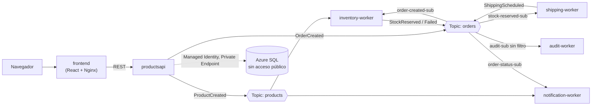

# Azure Microservices Demo

Arquitectura de microservicios event-driven en Azure Container Apps, con
networking privado (VNet + Private Endpoint), autoscaling basado en eventos
(KEDA), y un pipeline de pedidos encadenado que simula una bodega/e-commerce.

Construido como proyecto de aprendizaje práctico de Azure — ver
[`docs/AZURE-LEARNING-GUIDE.md`](docs/AZURE-LEARNING-GUIDE.md) para la guía
completa paso a paso, incluyendo los errores reales encontrados en el camino
y cómo se resolvieron.

## Arquitectura



Todos los servicios corren como **Azure Container Apps** dentro de la misma
VNet, autenticándose entre sí y hacia SQL vía **Managed Identity** (sin
passwords ni connection strings con secretos hardcodeados).

## Servicios (`src/`)

| Servicio | Rol |
|---|---|
| `ProductsApi` | API REST (.NET) — catálogo de productos, pedidos, dashboard de estado |
| `InventoryWorker` | Revisa/decrementa stock real al recibir un pedido |
| `ShippingWorker` | Simula preparar el envío una vez reservado el stock |
| `NotificationWorker` | Notifica éxito/fallo del pedido (sin acceso a base de datos) |
| `AuditWorker` | Registra cada evento del pipeline en una tabla de auditoría (sin filtro, recibe todo) |
| `frontend` | Dashboard en React — productos, pedidos, línea de tiempo, estado de la arquitectura en vivo |

## Desplegar desde cero

Los scripts en `scripts/` están numerados en el orden en que se deben correr:

```bash
cd scripts
./01-create-network.sh
./02-create-acr-and-env.sh
./03-create-service-bus.sh
./04-create-sql.sh              # sigue las instrucciones que imprime al final (paso manual de esquema SQL)
./05-build-and-push-images.sh
./06-deploy-container-apps.sh
./07-configure-rbac-and-scaling.sh
```

Después de `04-create-sql.sh`, corre manualmente `scripts/sql/01-schema.sql`
y `scripts/sql/02-grant-managed-identities.sql` en el Query Editor del portal
(con el acceso público temporalmente habilitado, como indica el script).

Para generar carga de prueba y observar el autoscaling:
```bash
./scripts/load-test.sh 50
```

## Infraestructura como código (`infra/`)

Ver [`infra/README.md`](infra/README.md).

## Documentación

- [`docs/AZURE-LEARNING-GUIDE.md`](docs/AZURE-LEARNING-GUIDE.md) — guía completa, incluye teoría de networking, RBAC, KEDA, troubleshooting real.
- [`docs/AZ-900-STUDY-PATH.md`](docs/AZ-900-STUDY-PATH.md) — path de estudio para el examen AZ-900, mapeando qué de este proyecto ya cubre el temario y qué falta repasar de forma puramente conceptual.
