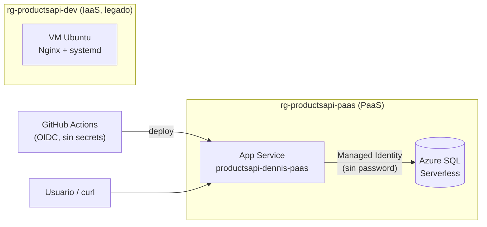
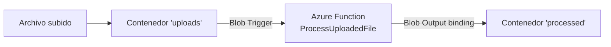
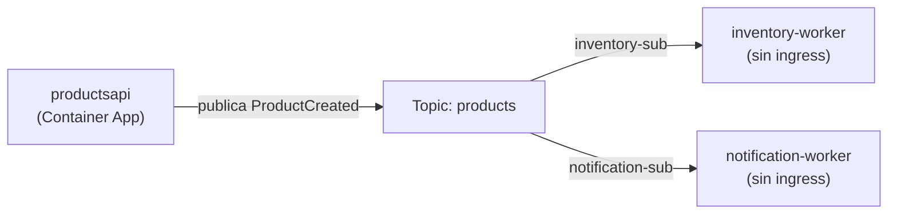
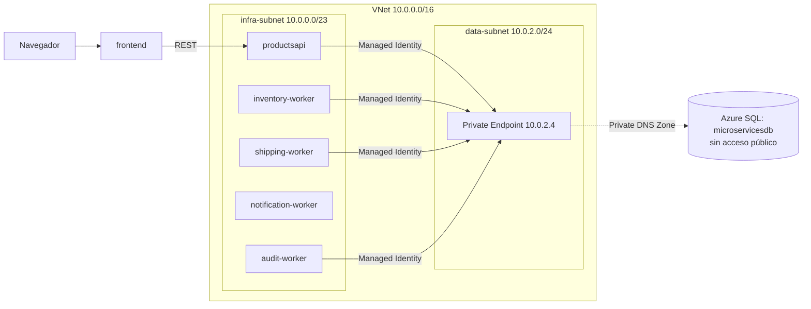
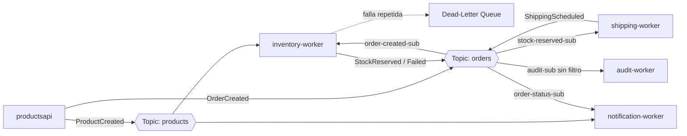

# Guía práctica de Azure — De IaaS a Serverless

Esta guía documenta proyectos reales hechos paso a paso en Azure, incluyendo los errores encontrados y cómo se resolvieron. Pensada para onboarding de equipo o como referencia rápida.

**Convenciones usadas**: nombres de recursos con prefijo por tipo (`rg-`, `sql-`, `st`, `asp-`), región `centralus`, mínimo privilegio en todos los roles asignados.

---

## Proyecto 1: Web API — de VM a PaaS + Base de datos administrada



### Contexto
Partimos de una API REST en .NET (`ProductsApi`) ya desplegada en una **VM (IaaS)** con Nginx + systemd + SQLite. El objetivo: migrarla a servicios administrados (PaaS) y comparar ambos enfoques.

### 1.1 Arquitectura IaaS original (para referencia)
- VNet + Subnet + NSG (reglas para puertos 80/22)
- IP pública Standard + NIC
- VM Ubuntu con Nginx (reverse proxy) + servicio systemd corriendo la API
- Key Vault (para secretos)
- Todo definido en Bicep (`infra/main.bicep`), desplegado vía GitHub Actions con SSH/SCP

**Costo**: cobra 24/7 (VM + disco + IP), independientemente del uso.

### 1.2 Migración a App Service (PaaS)

```bash
az group create --name rg-productsapi-paas --location centralus

az appservice plan create \
  --name asp-productsapi-paas \
  --resource-group rg-productsapi-paas \
  --is-linux --sku B1

az webapp create \
  --name productsapi-dennis-paas \
  --resource-group rg-productsapi-paas \
  --plan asp-productsapi-paas \
  --runtime "DOTNETCORE:10.0"
```

Deploy manual (para la primera prueba):
```bash
dotnet publish ProductsApi.csproj -c Release -o ./publish
cd publish && zip -r ../app.zip . && cd ..
az webapp deploy --resource-group rg-productsapi-paas --name productsapi-dennis-paas --src-path app.zip --type zip
```

**Diferencia clave vs VM**: no hay que instalar el runtime, configurar Nginx, ni administrar el SO — Azure lo hace.

### 1.3 CI/CD sin secretos (OIDC + Federated Credentials)

En vez de guardar contraseñas/API keys en GitHub, se usa una identidad federada:

```bash
# 1. App Registration (identidad de la aplicación en Entra ID)
az ad app create --display-name "gh-actions-productsapi" --query "{appId:appId, id:id}"

# 2. Service Principal (instancia de esa identidad en el tenant)
az ad sp create --id <appId>

# 3. Rol RBAC con mínimo privilegio, scoped SOLO al resource group necesario
az role assignment create \
  --assignee <appId> \
  --role "Website Contributor" \
  --scope /subscriptions/<sub-id>/resourceGroups/rg-productsapi-paas

# 4. Federated Credential: confía en tokens de GitHub Actions solo desde este repo/rama
az ad app federated-credential create --id <appId> --parameters '{
  "name": "gh-actions-main",
  "issuer": "https://token.actions.githubusercontent.com",
  "subject": "repo:<org>/<repo>:ref:refs/heads/main",
  "audiences": ["api://AzureADTokenExchange"]
}'
```

Secrets en GitHub (`Settings > Secrets and variables > Actions`): `AZURE_CLIENT_ID`, `AZURE_TENANT_ID`, `AZURE_SUBSCRIPTION_ID`.

Workflow (`.github/workflows/deploy-appservice.yml`) — puntos clave:
```yaml
permissions:
  id-token: write   # necesario para pedir el token OIDC
  contents: read
steps:
  - uses: azure/login@v2
    with:
      client-id: ${{ secrets.AZURE_CLIENT_ID }}
      tenant-id: ${{ secrets.AZURE_TENANT_ID }}
      subscription-id: ${{ secrets.AZURE_SUBSCRIPTION_ID }}
  - uses: azure/webapps-deploy@v3
    with:
      app-name: productsapi-dennis-paas
      package: ./publish
```

> ⚠️ No subir `publish/` ni `*.zip` al repo — agregarlos a `.gitignore`.

### 1.4 Azure SQL Database con Managed Identity (sin contraseñas)

```bash
# Server con SOLO autenticación Azure AD (sin admin SQL clásico)
az sql server create \
  --resource-group rg-productsapi-paas \
  --name sql-productsapi-dennis \
  --location centralus \
  --enable-ad-only-auth \
  --external-admin-principal-type User \
  --external-admin-name "<tu-upn>" \
  --external-admin-sid "<tu-object-id>"

# Firewall: permitir servicios de Azure (App Service) y tu IP para administración
az sql server firewall-rule create --resource-group rg-productsapi-paas --server sql-productsapi-dennis \
  --name AllowAzureServices --start-ip-address 0.0.0.0 --end-ip-address 0.0.0.0

# Base de datos serverless (auto-pausa = ahorro de costos)
az sql db create \
  --resource-group rg-productsapi-paas --server sql-productsapi-dennis --name productsapidb \
  --edition GeneralPurpose --family Gen5 --capacity 1 \
  --compute-model Serverless --auto-pause-delay 60 --min-capacity 0.5

# Managed Identity del App Service
az webapp identity assign --resource-group rg-productsapi-paas --name productsapi-dennis-paas
```

**Autorizar la identidad dentro de la BD** (vía Query Editor del portal, conectado con tu cuenta AAD admin):
```sql
CREATE USER [productsapi-dennis-paas] FROM EXTERNAL PROVIDER;
ALTER ROLE db_datareader ADD MEMBER [productsapi-dennis-paas];
ALTER ROLE db_datawriter ADD MEMBER [productsapi-dennis-paas];
```
> No se otorgan permisos DDL (crear/alterar tablas) a la identidad de la app — el esquema se crea una vez, manualmente, como admin.

**Connection string** (App Service → Configuration → Connection strings, tipo `SQLAzure`):
```
Server=tcp:sql-productsapi-dennis.database.windows.net,1433;Database=productsapidb;Authentication=Active Directory Managed Identity;Encrypt=True;TrustServerCertificate=False;
```

**Código (`Program.cs`)**: switch entre SQLite (dev local) y SQL Server (prod), controlado por un app setting `UseSqlServer=true`; en SQL Server se usa `EnsureCreated()` en vez de `Migrate()` (no se mantiene un set de migraciones separado para ese proveedor).

### 1.5 Problemas reales encontrados y solución

| Problema | Causa | Solución |
|---|---|---|
| `MissingSubscriptionRegistration` (Microsoft.Sql / Microsoft.Storage) | El resource provider no estaba registrado en la suscripción | `az provider register --namespace <Microsoft.X>` |
| `AADSTS700016` en GitHub Actions login | Secret de GitHub mal copiado (espacio/salto de línea) | Borrar y re-crear el secret con cuidado al pegar |
| `Keyword not supported: 'connection timeout'` / `'connect timeout'` | Ese keyword no es válido en la versión instalada de `Microsoft.Data.SqlClient` | Quitar el parámetro de timeout de la connection string (usa el default) |
| `CREATE TABLE permission denied` | La Managed Identity solo tiene `db_datareader`/`db_datawriter`, sin DDL (correcto por diseño) | Crear la tabla manualmente como admin AAD antes de que la app llame `EnsureCreated()` |
| Query Editor: "Your IP isn't allowed" | Firewall del SQL Server no incluye tu IP de cliente | `az sql server firewall-rule create` con tu IP pública |

---

## Proyecto 2: Pipeline Serverless con Azure Functions

### Arquitectura



Sin servidor corriendo 24/7: la función se activa solo cuando llega un archivo nuevo (plan de Consumo — pago por ejecución, escala a cero).

### 2.1 Setup local
```bash
npm install -g azure-functions-core-tools@4 --unsafe-perm true

func init BlobProcessor --worker-runtime dotnet-isolated --target-framework net8.0
cd BlobProcessor
func new --template "Blob trigger" --name ProcessUploadedFile
```

> Si `func` falla con `ENOENT` en el primer uso: el binario se descarga en el primer `func --version`, pero puede fallar la auto-extracción. Verificar/extraer manualmente:
> `unzip -o Azure.Functions.Cli.linux-x64.<version>.zip` en la carpeta `bin/` del paquete npm, y `chmod +x func`.

### 2.2 Código (`ProcessUploadedFile.cs`)
```csharp
[Function(nameof(ProcessUploadedFile))]
[BlobOutput("processed/{name}-metadata.json", Connection = "AzureWebJobsStorage")]
public string Run(
    [BlobTrigger("uploads/{name}", Connection = "AzureWebJobsStorage")] byte[] content,
    string name)
{
    var metadata = new { fileName = name, sizeBytes = content.Length, processedAtUtc = DateTime.UtcNow };
    return JsonSerializer.Serialize(metadata);
}
```
> **Usar `byte[]`, no `Stream`**, para el parámetro del trigger en el modelo *isolated worker*. `Stream` requiere configuración adicional de "SDK type bindings" y en la práctica falló con `System.NotSupportedException: Deserialization of interface or abstract types is not supported`.

### 2.3 Recursos en Azure
```bash
az group create --name rg-blobprocessor --location centralus

az storage account create --name stblobprocdennis --resource-group rg-blobprocessor --location centralus --sku Standard_LRS
az storage container create --name uploads --account-name stblobprocdennis --auth-mode login
az storage container create --name processed --account-name stblobprocdennis --auth-mode login

az functionapp create \
  --resource-group rg-blobprocessor --consumption-plan-location centralus \
  --runtime dotnet-isolated --runtime-version 8 --functions-version 4 \
  --name blobprocessor-dennis --storage-account stblobprocdennis --os-type Linux

func azure functionapp publish blobprocessor-dennis
```

### 2.4 Permisos: plano de control vs. plano de datos (IMPORTANTE)

Crear recursos (`storage account create`, `container create`) usa tu rol de **gestión** (Owner/Contributor de la suscripción). **Leer o escribir el contenido** de un blob usa un rol de **datos**, que es independiente:

```bash
az role assignment create \
  --assignee <tu-object-id> \
  --role "Storage Blob Data Contributor" \
  --scope /subscriptions/<sub-id>/resourceGroups/rg-blobprocessor/providers/Microsoft.Storage/storageAccounts/stblobprocdennis
```

Regla mental: si la operación es "cambiar cómo existe el recurso" → rol de gestión. Si es "tocar lo que hay dentro" (blobs, filas, mensajes) → rol de datos (`*Data Contributor`, `*Data Reader`, o en SQL: `db_datareader`/`db_datawriter`).

### 2.5 Problemas reales encontrados y solución

| Problema | Causa | Solución |
|---|---|---|
| `SubscriptionNotFound` al crear storage account | `Microsoft.Storage` no registrado | `az provider register --namespace Microsoft.Storage` |
| `Invalid version: 10.0` en `functionapp create` | Formato de versión incorrecto | Usar `--runtime-version 10` (sin `.0`) |
| Function App queda en 503 permanente / SCM inaccesible | **.NET 10 sin soporte aún en Functions Consumption Linux** (sí soportado en App Service) | Bajar `TargetFramework` a `net8.0` (LTS) y `az functionapp config set --linux-fx-version "DOTNET-ISOLATED|8.0"` |
| Blob sube pero función nunca corre (`processed` vacío) | La función SÍ se ejecutaba pero fallaba al instante (ver pestaña **Invocations** del Function App en el portal, no solo `az webapp log tail`) | Bug de conversión `Stream` → cambiar a `byte[]` |
| `az storage blob upload` con `--auth-mode login`: "You do not have the required permissions" | Falta rol de plano de **datos** | Asignar `Storage Blob Data Contributor` (ver 2.4) |
| `func azure functionapp publish` falla en "Syncing triggers" | Runtime de la Function App no coincide bien con el paquete desplegado (causa raíz real era el problema de .NET 10 del punto anterior) | Resuelto al bajar a .NET 8 |

---

## Proyecto 3: Microservicios event-driven con Container Apps + Service Bus

### Contexto y mapeo de conceptos (si vienes de AWS)

| AWS | Azure (equivalente más cercano) | Notas |
|---|---|---|
| SQS (cola punto-a-punto) | **Service Bus Queue** | Un mensaje → un solo consumidor |
| SNS (pub/sub, fan-out) | **Service Bus Topic + Subscriptions** | Un mensaje → copiado a cada suscripción independiente |
| EventBridge | **Event Grid** | Más para "reaccionar a eventos del sistema" que mensajería de negocio |
| ECS/Fargate | **Azure Container Apps** | |
| API Gateway | **Azure API Management** | Opcional, no usado en este proyecto |

### Arquitectura



Cada pieza es un **Container App independiente** dentro del mismo **Container Apps Environment** — despliegue, escalado y ciclo de vida independientes entre sí.

### 3.1 Registrar providers y crear ACR

```bash
az provider register --namespace Microsoft.ContainerRegistry
az provider register --namespace Microsoft.App
az provider register --namespace Microsoft.OperationalInsights

az group create --name rg-microservices --location centralus

az acr create --resource-group rg-microservices --name acrproductsdennis --sku Basic --admin-enabled false
```

> `--admin-enabled false`: nos autenticamos con `az acr login` (tu sesión de az) o con Managed Identity — nunca con credenciales de admin estáticas.

### 3.2 Dockerfile multi-stage (.NET)

```dockerfile
# Build stage: SDK completo (compilador, NuGet)
FROM mcr.microsoft.com/dotnet/sdk:10.0 AS build
WORKDIR /src
COPY *.csproj .
RUN dotnet restore
COPY . .
RUN dotnet publish -c Release -o /app/publish --no-restore

# Runtime stage: solo el runtime, imagen final mucho más liviana
FROM mcr.microsoft.com/dotnet/aspnet:10.0 AS runtime   # usar dotnet/runtime (sin "aspnet") si el proyecto NO expone HTTP (ej. un worker)
WORKDIR /app
COPY --from=build /app/publish .
ENV ASPNETCORE_URLS=http://+:8080   # solo aplica a APIs HTTP
EXPOSE 8080
ENTRYPOINT ["dotnet", "TuApp.dll"]
```

> **Truco de caché de capas**: copiar el `.csproj` y hacer `restore` ANTES de copiar el resto del código — si solo cambia código y no dependencias, Docker reutiliza esa capa en el siguiente build.

Build + push:
```bash
docker build -t productsapi:local .
docker run -d -p 8080:8080 --name test productsapi:local && curl http://localhost:8080/api/products   # probar local antes de subir

az acr login --name acrproductsdennis
docker tag productsapi:local acrproductsdennis.azurecr.io/productsapi:v1
docker push acrproductsdennis.azurecr.io/productsapi:v1
```

### 3.3 Container Apps Environment + primera Container App

```bash
az containerapp env create --name cae-microservices --resource-group rg-microservices --location centralus
# Puede tardar 5-10 min la primera vez (crea Log Analytics workspace de fondo). Verificar con:
az containerapp env show --name cae-microservices --resource-group rg-microservices --query provisioningState -o tsv

az containerapp create \
  --name productsapi --resource-group rg-microservices --environment cae-microservices \
  --image acrproductsdennis.azurecr.io/productsapi:v1 --target-port 8080 --ingress external \
  --registry-server acrproductsdennis.azurecr.io --registry-identity system
```

> `--registry-identity system`: crea una Managed Identity para la Container App y le otorga automáticamente `AcrPull` sobre el registro — sin credenciales, sin paso manual de `role assignment create`.

### 3.4 Service Bus: Topic + Subscriptions (el "SNS" de Azure)

```bash
az servicebus namespace create --resource-group rg-microservices --name sb-microservices-dennis --location centralus --sku Standard  # Standard requerido para Topics
az servicebus topic create --resource-group rg-microservices --namespace-name sb-microservices-dennis --name products
az servicebus topic subscription create --resource-group rg-microservices --namespace-name sb-microservices-dennis --topic-name products --name inventory-sub
az servicebus topic subscription create --resource-group rg-microservices --namespace-name sb-microservices-dennis --topic-name products --name notification-sub
```

**Publicar un evento** (código en la API, usando Managed Identity — sin connection string con clave):
```csharp
var client = new ServiceBusClient(serviceBusNamespace, new DefaultAzureCredential());
var sender = client.CreateSender("products");
await sender.SendMessageAsync(new ServiceBusMessage(JsonSerializer.Serialize(payload)) { Subject = "ProductCreated" });
```

**Consumir un evento** (código en cada worker, patrón `ServiceBusProcessor`):
```csharp
var processor = client.CreateProcessor("products", "inventory-sub");
processor.ProcessMessageAsync += async args => {
    // procesar args.Message.Body ...
    await args.CompleteMessageAsync(args.Message); // quita el mensaje de la suscripción
};
processor.ProcessErrorAsync += args => { /* loggear */ return Task.CompletedTask; };
await processor.StartProcessingAsync();
```

> Si nunca se llama `CompleteMessageAsync` (o el proceso se cae antes), Service Bus **redelivera el mensaje automáticamente** tras el lock timeout — no se pierde.

**Permisos RBAC de datos** (patrón repetido de todo el proyecto): otorgar a nivel de la entidad específica, no de todo el namespace:
```bash
# Sender (la API)
az role assignment create --assignee <principalId-api> --role "Azure Service Bus Data Sender" \
  --scope /subscriptions/<sub>/resourceGroups/rg-microservices/providers/Microsoft.ServiceBus/namespaces/sb-microservices-dennis

# Receiver (cada worker, scoped SOLO a su propia suscripción)
az role assignment create --assignee <principalId-worker> --role "Azure Service Bus Data Receiver" \
  --scope /subscriptions/<sub>/resourceGroups/rg-microservices/providers/Microsoft.ServiceBus/namespaces/sb-microservices-dennis/topics/products/subscriptions/inventory-sub
```

### 3.5 Desplegar los workers (sin ingress, siempre activos)

```bash
az containerapp create \
  --name inventory-worker --resource-group rg-microservices --environment cae-microservices \
  --image acrproductsdennis.azurecr.io/inventoryworker:v1 \
  --registry-server acrproductsdennis.azurecr.io --registry-identity system \
  --min-replicas 1 --max-replicas 1 \
  --env-vars ServiceBusNamespace=sb-microservices-dennis.servicebus.windows.net
```

> Sin `--ingress` (no reciben HTTP). `--min-replicas 1` los mantiene siempre escuchando — ver sección de KEDA más abajo para escalar a 0 basado en profundidad de cola en vez de esto.

**Diagnóstico útil**:
```bash
az containerapp logs show --name inventory-worker --resource-group rg-microservices --tail 20
az containerapp revision list --name inventory-worker --resource-group rg-microservices --query "[0].name" -o tsv
az containerapp revision restart --name inventory-worker --resource-group rg-microservices --revision <nombre-revision>
az servicebus topic subscription show --resource-group rg-microservices --namespace-name sb-microservices-dennis --topic-name products --name inventory-sub --query countDetails
```

### 3.6 Autoscaling con KEDA (escalar workers según profundidad de cola)

Por defecto usamos `--min-replicas 1` (worker siempre prendido). Con KEDA, se puede escalar a 0 cuando no hay mensajes, y hacia arriba cuando se acumula un backlog — **reduce el costo de cómputo sin afectar el costo fijo de Service Bus**.

```bash
# El scaler necesita una credencial para CONSULTAR la profundidad de la cola.
# Este es un caso puntual donde se usa una connection string (no Managed Identity) —
# el código de negocio del worker sigue usando Managed Identity sin cambios.
az servicebus namespace authorization-rule keys list \
  --resource-group rg-microservices --namespace-name sb-microservices-dennis \
  --name RootManageSharedAccessKey --query primaryConnectionString -o tsv

az containerapp secret set --name inventory-worker --resource-group rg-microservices \
  --secrets 'servicebus-conn=<connection-string>'

az containerapp update --name inventory-worker --resource-group rg-microservices \
  --min-replicas 0 --max-replicas 3 \
  --scale-rule-name servicebus-scaler --scale-rule-type azure-servicebus \
  --scale-rule-metadata "topicName=products" "subscriptionName=inventory-sub" "namespace=sb-microservices-dennis" "messageCount=5" \
  --scale-rule-auth "connection=servicebus-conn"
```

**Fórmula de KEDA**: `réplicas_deseadas = techo(mensajes_activos / messageCount)`, recortado (clamp) entre `min-replicas` y `max-replicas`. Ej.: 40 mensajes con `messageCount=5` → querría 8 réplicas, pero si `max-replicas=3`, se limita a 3.

Otros parámetros relevantes (no configurados explícitamente, usan default):
- `pollingInterval` (default 30s): cada cuánto reevalúa el backlog.
- `cooldownPeriod` (default 300s): tiempo sin trabajo antes de bajar a 0 (evita "flapping").

> ⚠️ **Importante**: si el procesamiento es demasiado rápido (ej. solo un log), nunca se acumula backlog suficiente para observar el scale-out, aunque la carga sea alta — KEDA solo ve el backlog *en el momento del polling*. Para pruebas de carga realistas, simula latencia de procesamiento acorde a un caso real.

Verificar réplicas activas en cualquier momento:
```bash
az containerapp replica list --name inventory-worker --resource-group rg-microservices -o table
```

### 3.7 Dead-Letter Queue (DLQ): manejar mensajes que fallan

Cuando un mensaje falla repetidamente (excepción no manejada, sin llamar `CompleteMessageAsync`), tras `MaxDeliveryCount` intentos Service Bus lo mueve automáticamente a una sub-cola de "cartas muertas" — no se pierde, ni bloquea el procesamiento de mensajes sanos.

```bash
# Reducir reintentos para pruebas (default es 10)
az servicebus topic subscription update \
  --resource-group rg-microservices --namespace-name sb-microservices-dennis \
  --topic-name products --name inventory-sub --max-delivery-count 2
```

Código: simplemente lanzar una excepción sin completar el mensaje es suficiente — el SDK maneja el resto (no llama a `CompleteMessageAsync`, el lock expira, se redelivera, y al agotar los intentos, Service Bus lo mueve al DLQ automáticamente).

**Inspeccionar el DLQ**: no hay comando `az` para leer contenido de mensajes (es plano de datos) — usar **Service Bus Explorer** en el portal: namespace → Topics → tu topic → tu subscription → "Service Bus Explorer" → cambiar a pestaña **"Dead-letter"** → "Peek from start". Ahí se ve el `Delivery Count`, el cuerpo del mensaje original, y metadata del fallo.

```bash
# Confirmar cuántos mensajes hay en DLQ vs activos
az servicebus topic subscription show --resource-group rg-microservices \
  --namespace-name sb-microservices-dennis --topic-name products --name inventory-sub \
  --query countDetails
# { "activeMessageCount": 0, "deadLetterMessageCount": 1, ... }
```

**Reprocesar un mensaje tras arreglar el bug** — flujo real:
1. Corregir el bug en el código, rebuild + push + `az containerapp update` con la nueva imagen.
2. En Service Bus Explorer (pestaña Dead-letter): seleccionar el mensaje → **"Re-send selected messages"**.

> ⚠️ **Lección importante**: "Re-send" **crea una copia nueva** en la cola activa para reprocesar — **NO elimina el mensaje original del DLQ**. Son operaciones distintas. Para eliminar realmente el mensaje del DLQ (una vez confirmado que el reproceso fue exitoso), hay que cambiar el modo del explorer de "Peek" a **"Receive and Delete"** y recibirlo desde ahí — eso sí lo remueve permanentemente. Si solo usas "Peek" o "Re-send", el contador `deadLetterMessageCount` no bajará aunque el reproceso haya sido exitoso.

### 3.8 Problemas reales encontrados y solución

| Problema | Causa | Solución |
|---|---|---|
| `error CS0433: DefaultAzureCredential exists in both Azure.Core and Azure.Identity` | `Azure.Messaging.ServiceBus` trajo una versión más nueva de `Azure.Core` que ya no es compatible con la versión vieja de `Azure.Identity` referenciada directamente | `dotnet add package Azure.Identity --version <última>` para alinear versiones |
| `az containerapp restart` no existe | El comando correcto opera a nivel de **revisión**, no de la app | `az containerapp revision restart --name <app> --revision <nombre-revision>` |
| Mensajes no se consumían hasta hacer restart | El role assignment de RBAC de datos se creó DESPUÉS de que el worker ya hubiera intentado (y fallado) conectarse | Reintentos automáticos del SDK eventualmente lo resuelven, pero un restart manual acelera la recuperación tras cambios de permisos |

---

## Proyecto 3b: Agregar networking real (VNet + Private Endpoint) a los microservicios

### Arquitectura de red resultante



> Nota: `shipping-worker` y `audit-worker` aparecen aquí porque este diagrama representa el estado final (tras el Proyecto 3c) — al momento de agregar solo la VNet/Private Endpoint, únicamente existían `productsapi`, `inventory-worker` y `notification-worker`.

### Conceptos base de networking en Azure

| Concepto | Qué es |
|---|---|
| **VNet** | Tu espacio privado de direcciones IP dentro de Azure — aislado del resto de internet por defecto |
| **Subnet** | Subdivisión de la VNet, con sus propias reglas (delegación, NSG) |
| **NSG** | Firewall de reglas permitir/denegar, aplicado a nivel de subnet o NIC |
| **Private Endpoint** | IP privada dentro de tu VNet que representa un servicio PaaS (SQL, Storage) — el tráfico nunca sale a internet público |
| **Private DNS Zone** | Resuelve el hostname público del servicio hacia la IP privada del Private Endpoint |

**Notación CIDR** (`/16`, `/23`, `/24`): el número indica cuántos bits están "fijos" (identifican la red); los bits restantes son direcciones disponibles. Menos bits fijos = rango más grande:
- `/16` → 65,536 IPs (una VNet completa)
- `/23` → 512 IPs (una subnet mediana)
- `/24` → 256 IPs (una subnet más chica)

Las subnets viven dentro del rango de la VNet y no se pueden superponer entre sí.

### Crear la VNet y subnets

```bash
az network vnet create --resource-group rg-microservices --name vnet-microservices \
  --address-prefix 10.0.0.0/16 --subnet-name infra-subnet --subnet-prefix 10.0.0.0/23

az network vnet subnet create --resource-group rg-microservices --vnet-name vnet-microservices \
  --name data-subnet --address-prefix 10.0.2.0/24

# Container Apps con "workload profiles" requiere delegación de la subnet de infraestructura
az network vnet subnet update --resource-group rg-microservices --vnet-name vnet-microservices \
  --name infra-subnet --delegations Microsoft.App/environments

az network nsg create --resource-group rg-microservices --name nsg-infra-subnet
az network vnet subnet update --resource-group rg-microservices --vnet-name vnet-microservices \
  --name infra-subnet --network-security-group nsg-infra-subnet
```

> Un NSG recién creado sin reglas propias **ya tiene reglas por defecto invisibles**: permite tráfico dentro de la misma VNet, permite el Load Balancer de Azure, y deniega todo lo entrante desde internet salvo que abras algo explícitamente.

### ⚠️ Importante: el Container Apps Environment NO se puede "actualizar" a VNet

Si ya tienes un Container Apps Environment sin VNet, **no puedes agregarle integración a VNet después** — hay que:
1. Borrar las Container Apps que viven en él (`az containerapp delete`).
2. Borrar el environment (`az containerapp env delete`).
3. Crear un nuevo environment con `--infrastructure-subnet-resource-id`.
4. Recrear las Container Apps en el nuevo environment.

```bash
az containerapp delete --name productsapi --resource-group rg-microservices --yes
az containerapp delete --name inventory-worker --resource-group rg-microservices --yes
az containerapp delete --name notification-worker --resource-group rg-microservices --yes
az containerapp env delete --name cae-microservices --resource-group rg-microservices --yes

SUBNET_ID=$(az network vnet subnet show --resource-group rg-microservices --vnet-name vnet-microservices --name infra-subnet --query id -o tsv)
az containerapp env create --name cae-microservices-vnet --resource-group rg-microservices \
  --location centralus --infrastructure-subnet-resource-id $SUBNET_ID
```

> Al recrear las Container Apps, sus **Managed Identities son completamente nuevas** (nuevo `principalId`) — hay que re-otorgar TODOS los role assignments (RBAC de Service Bus, etc.) y reconfigurar los KEDA scale rules (incluyendo el secreto de connection string), porque no se heredan del recurso anterior.

### Diagnóstico de red dentro de un contenedor: `az containerapp exec`

Para entrar a un contenedor corriendo y probar conectividad/DNS directamente:
```bash
az containerapp exec --name inventory-worker --resource-group rg-microservices --command "cat /etc/resolv.conf"
az containerapp exec --name inventory-worker --resource-group rg-microservices --command "getent hosts <hostname>"
# probar si un puerto específico está abierto:
az containerapp exec --name inventory-worker --resource-group rg-microservices \
  --command "bash -c 'timeout 5 bash -c \"echo > /dev/tcp/<host>/<puerto>\" && echo OPEN || echo CLOSED'"
```
> Si el contenedor está en crash-loop (reiniciándose constantemente por una excepción no manejada), el exec puede fallar con `Cannot attach to a container that is not running` — es señal de que hay que arreglar el código/config antes de poder inspeccionar interactivamente.

### AMQP sobre WebSockets (mitigación común, no siempre la causa raíz)

Si el SDK de Service Bus falla al conectar en un entorno con VNet, una causa común es que el puerto AMQP nativo (**5671**) esté bloqueado mientras HTTPS (**443**) sigue abierto. Solución:
```csharp
new ServiceBusClient(namespace, credential,
    new ServiceBusClientOptions { TransportType = ServiceBusTransportType.AmqpWebSockets });
```

### 🔎 Lección de debugging real: no todo error de red ES un error de red

Aplicamos el fix de WebSockets de arriba, y el error **cambió de forma pero seguía fallando**. Al leer el mensaje completo de la excepción con cuidado (no solo el stack trace), apareció:
```
System.Net.Http.HttpRequestException: Name or service not known (sb-miroservices-dennis.servicebus.windows.net:443)
```
**Faltaba una "c"**: `miroservices` en vez de `microservices` — un typo en la variable de entorno `ServiceBusNamespace`, no un problema de red/VNet/DNS/puertos en absoluto. La causa raíz estaba en el propio mensaje de error desde el principio.

**Moraleja**: cuando un error de conectividad persiste tras aplicar el fix "típico", **vuelve a leer el mensaje de excepción completo, letra por letra**, antes de asumir que es algo más exótico (red, DNS, firewall). Los mensajes de error de Azure suelen incluir el hostname/valor exacto que se intentó usar — a veces ahí está la respuesta completa.

### Buena práctica adoptada: scripts `.sh` para comandos largos

Pegar comandos largos en la terminal puede corromperse por el wrap visual (una línea se corta y el shell interpreta la segunda mitad como un comando nuevo). Para evitarlo, cuando un comando es largo o tiene múltiples pasos, escribirlo en un archivo `.sh` y ejecutarlo con `bash archivo.sh` — elimina el riesgo por completo y además queda como artefacto reutilizable.

### Private Endpoint para Azure SQL (cerrar el acceso público por completo)

```bash
# 1. Private DNS Zone + vínculo a la VNet
az network private-dns zone create --resource-group rg-microservices --name privatelink.database.windows.net
az network private-dns link vnet create --resource-group rg-microservices \
  --zone-name privatelink.database.windows.net --name dns-link-microservices \
  --virtual-network vnet-microservices --registration-enabled false

# 2. Private Endpoint apuntando al SQL Server, en la subnet de datos
SQL_ID=$(az sql server show --resource-group rg-microservices --name sql-microservices-dennis --query id -o tsv)
az network private-endpoint create --resource-group rg-microservices --name pe-sql-microservices \
  --vnet-name vnet-microservices --subnet data-subnet \
  --private-connection-resource-id $SQL_ID --group-id sqlServer --connection-name pe-sql-connection

# 3. Grupo de DNS: registra automáticamente el registro A en la Private DNS Zone
az network private-endpoint dns-zone-group create --resource-group rg-microservices \
  --endpoint-name pe-sql-microservices --name sql-dns-zone-group \
  --private-dns-zone privatelink.database.windows.net --zone-name sql

# 4. Verificar resolución DNS desde dentro de la VNet (debe dar una IP 10.0.2.x)
az containerapp exec --name productsapi --resource-group rg-microservices \
  --command "getent hosts sql-microservices-dennis.database.windows.net"

# 5. Una vez confirmado que la app conecta bien vía el Private Endpoint, cerrar el público:
az sql server update --resource-group rg-microservices --name sql-microservices-dennis \
  --set publicNetworkAccess=Disabled
```

Tras esto, `productsapi` (dentro de la VNet) sigue funcionando normal; cualquier intento de conexión desde fuera de la VNet (ej. tu laptop, el Query Editor del portal) deja de funcionar — el SQL Server ya no tiene superficie pública expuesta.

### Frontend en React: dashboard de observabilidad

Un frontend simple (Vite + React) que consume:
- `GET /api/products` y `POST /api/products` (CRUD ya existente)
- `GET /api/status` (nuevo endpoint que expone el estado en vivo de la arquitectura)

**Endpoint `/api/status`**: usa `ServiceBusAdministrationClient` para leer contadores de mensajes activos/dead-letter de cada suscripción, y cuenta filas en la base de datos.

> ⚠️ **Trade-off de seguridad documentado**: `ServiceBusAdministrationClient` requiere el rol **`Azure Service Bus Data Owner`** (más amplio que `Data Sender`/`Data Receiver` usados en el resto del proyecto). Es una excepción consciente para habilitar observabilidad — no un descuido. En un proyecto real, considera mover este endpoint a un servicio "admin" separado con su propia identidad, en vez de ampliar los permisos de la API pública.

```bash
az role assignment create --assignee <principalId-productsapi> --role "Azure Service Bus Data Owner" \
  --scope /subscriptions/<sub>/resourceGroups/rg-microservices/providers/Microsoft.ServiceBus/namespaces/sb-microservices-dennis
```

**CORS**: necesario porque el frontend vive en un dominio distinto al backend:
```csharp
builder.Services.AddCors(options =>
    options.AddPolicy("frontend", policy => policy.AllowAnyOrigin().AllowAnyHeader().AllowAnyMethod()));
// ...
app.UseCors("frontend");
```

**Dockerfile del frontend** (build con Node, servir con Nginx — la variable `VITE_API_URL` se "hornea" en el build, no es una env var de runtime, porque Vite resuelve `import.meta.env.*` en tiempo de compilación):
```dockerfile
FROM node:22-alpine AS build
WORKDIR /src
COPY package*.json .
RUN npm install
COPY . .
ARG VITE_API_URL
RUN npm run build

FROM nginx:1.27-alpine AS runtime
COPY --from=build /src/dist /usr/share/nginx/html
EXPOSE 80
```

```bash
docker build --build-arg VITE_API_URL=https://productsapi.<dominio> -t acrproductsdennis.azurecr.io/frontend:v1 .
docker push acrproductsdennis.azurecr.io/frontend:v1
az containerapp create --name frontend --resource-group rg-microservices --environment cae-microservices-vnet \
  --image acrproductsdennis.azurecr.io/frontend:v1 --target-port 80 --ingress external \
  --registry-server acrproductsdennis.azurecr.io --registry-identity system
```

---

## Proyecto 3c: Pipeline de pedidos encadenado (simulación de bodega/e-commerce)

### Dominio y arquitectura

Se amplió el sistema a una simulación de bodega: `Order` (pedido) con estados `Pending → StockReserved → Shipped`, o `→ Failed` si no hay stock suficiente. 5 microservicios coordinados por eventos:



### Un solo Topic, múltiples tipos de evento, filtros SQL por suscripción

En vez de crear un topic por cada paso del pipeline, se reutiliza **un solo Topic** con distintos valores de `Subject` (el "tipo de evento"), y cada suscripción filtra con un **SQL Filter** sobre `sys.Label` (que es como Service Bus expone `Subject` en filtros):

```bash
az servicebus topic create --resource-group $RG --namespace-name $NS --name orders

az servicebus topic subscription create --resource-group $RG --namespace-name $NS --topic-name orders --name order-created-sub
az servicebus topic subscription rule create --resource-group $RG --namespace-name $NS --topic-name orders \
  --subscription-name order-created-sub --name OrderCreatedFilter --filter-sql-expression "sys.Label = 'OrderCreated'"
az servicebus topic subscription rule delete --resource-group $RG --namespace-name $NS --topic-name orders \
  --subscription-name order-created-sub --name '$Default'   # sin esto, la regla default (TrueFilter) sigue matcheando TODO

# Filtro con múltiples valores:
az servicebus topic subscription rule create ... --filter-sql-expression "sys.Label IN ('StockReservationFailed','ShippingScheduled')"

# Sin filtro (recibe todos los eventos, para auditoría):
az servicebus topic subscription create --resource-group $RG --namespace-name $NS --topic-name orders --name audit-sub
```

### Workers con acceso directo a SQL (sin EF Core)

Los workers usan `Microsoft.Data.SqlClient` directo (no EF Core) con Managed Identity — más liviano para un microservicio pequeño que solo necesita 1-2 queries:
```csharp
var conn = new SqlConnection(connectionString); // Authentication=Active Directory Managed Identity
await conn.OpenAsync();
var cmd = new SqlCommand("UPDATE Orders SET Status = 'Shipped' WHERE Id = @OrderId;", conn);
cmd.Parameters.AddWithValue("@OrderId", orderId);
await cmd.ExecuteNonQueryAsync();
```

### Un mismo Container App puede escuchar múltiples suscripciones/topics

`inventory-worker` y `notification-worker` corren **2 `ServiceBusProcessor` en paralelo** dentro del mismo `BackgroundService` (uno para el flujo viejo de demo, otro para el pipeline real de pedidos) — no hace falta un Container App por cada suscripción.

> ⚠️ **Cada suscripción nueva que un worker escuche necesita su propio KEDA scale rule.** Si agregas un segundo `ServiceBusProcessor` a un worker pero no agregas un `--scale-rule-name` adicional para esa nueva suscripción, KEDA seguirá evaluando solo la suscripción original — el worker nunca escalará por mensajes acumulados en la suscripción nueva, aunque el código sí la esté escuchando.
> ```bash
> az containerapp update --name inventory-worker --resource-group $RG \
>   --scale-rule-name orders-scaler --scale-rule-type azure-servicebus \
>   --scale-rule-metadata "topicName=orders" "subscriptionName=order-created-sub" "namespace=$NS" "messageCount=5" \
>   --scale-rule-auth "connection=servicebus-conn"
> ```
> Container Apps soporta **múltiples scale rules** con nombres distintos en la misma app — cada una es independiente.

### Problemas reales encontrados y solución

| Problema | Causa | Solución |
|---|---|---|
| `Principal 'X' could not be found` al hacer `CREATE USER FROM EXTERNAL PROVIDER` | El Container App todavía no existía (Azure AD no tiene su Managed Identity registrada) | Crear/desplegar el Container App primero, LUEGO correr el `CREATE USER` |
| Base de datos sin acceso público al necesitar el Query Editor | Se había deshabilitado `publicNetworkAccess` en una sesión anterior | Habilitar temporalmente (`publicNetworkAccess=Enabled`), hacer el cambio de esquema, y volver a deshabilitar — aceptable en dev, en producción usar VPN/Bastion/pipeline dentro de la VNet en su lugar |
| `az role assignment list --assignee <id>` devuelve vacío aunque el rol sí existe | La tabla en formato `-o table` muestra `principalName` en la columna "Principal", no `principalId` — para Managed Identities ese nombre suele no ser legible, dando la falsa impresión de que no hay coincidencia | Verificar con `az role assignment list --scope <scope>` (sin `--assignee`) y comparar el campo `principalId` del JSON completo, no la columna de la tabla |
| `UnauthorizedAccessException: 'Listen' claim(s) required` justo después de crear un role assignment | Propagación de RBAC no es instantánea — puede tardar 1-2 minutos (a veces más) | Esperar y reintentar; no asumir que un fallo justo después de `role assignment create` significa que el rol está mal |
| Mensajes atascados en una suscripción nueva, el worker nunca escala desde 0 | Se agregó un segundo `ServiceBusProcessor` al código pero no un segundo KEDA `--scale-rule` para esa suscripción | Agregar un scale rule adicional por cada suscripción nueva que un worker escuche |
| `Cannot find an authentication provider for 'ActiveDirectoryManagedIdentity'` | Se instaló `Microsoft.Data.SqlClient` sin fijar versión → NuGet trajo la 7.0.2, que movió el soporte de Azure AD a un paquete separado | `dotnet add package Microsoft.Data.SqlClient.Extensions.Azure`. Lección: fijar versiones consistentes con el resto de la solución, y revisar release notes en saltos de versión "major" |
| `Invalid object name 'EventLogs'` | EF Core pluraliza el nombre de tabla por convención (`DbSet<EventLogEntry> EventLogs` → espera tabla `EventLogs`), pero la tabla real se creó como `EventLog` (singular) | `modelBuilder.Entity<EventLogEntry>().ToTable("EventLog")` para mapear explícitamente al nombre real |

---

## Proyecto 4: Infraestructura como código (Bicep) para los microservicios

### Bicep para principiantes (lo esencial)

**Declarativo vs. imperativo**: con `az` (CLI) le dices a Azure *"haz esto, luego esto"* paso a paso. Con Bicep describes *el resultado final que quieres*, y Azure decide cómo llegar ahí — por eso se puede comparar contra la realidad con `what-if` sin ejecutar nada.

**Anatomía de un archivo**:
```bicep
param location string              // entrada: quien use este archivo debe darle un valor
param acrName string

resource acr 'Microsoft.ContainerRegistry/registries@2023-07-01' = {
//     ↑         ↑                                    ↑
//  nombre    tipo de recurso                  versión de la API de Azure
//  simbólico (Microsoft.<Servicio>/<tipo>)
  name: acrName                     // el nombre REAL en Azure
  location: location
  sku: { name: 'Basic' }
}

output acrLoginServer string = acr.properties.loginServer   // salida: lo que este archivo "devuelve"
```
`acr` es solo una etiqueta para referirte al recurso **dentro de este mismo archivo** (ej. `acr.id`), aunque el recurso no exista todavía cuando escribes el código — Bicep resuelve esas referencias al desplegar.

**Dependencias implícitas**: si un recurso menciona `otroRecurso.id` en sus propiedades, Bicep automáticamente sabe que debe crear `otroRecurso` primero. No existe (ni hace falta) un `dependsOn` manual en la mayoría de los casos — la sola referencia ya establece el orden.

**Módulos**: un módulo es otro archivo `.bicep` tratado como una caja negra reutilizable, con sus propios `param` (entradas) y `output` (salidas):
```bicep
module network 'modules/network.bicep' = {
  name: 'network'                   // nombre de ESTA operación de despliegue anidada
  params: { location: location }
}

module containerAppsEnvironment 'modules/containerAppsEnvironment.bicep' = {
  name: 'containerAppsEnvironment'
  params: {
    infraSubnetId: network.outputs.infraSubnetId   // el output de un módulo alimenta el input de otro
  }
}
```
Así se encadenan 8 archivos en un solo sistema coherente: cada módulo produce outputs que el siguiente consume como inputs, y Bicep resuelve el orden solo.

**Managed Identity + RBAC, sin buscar el `principalId` a mano**: `identity: { type: 'SystemAssigned' }` en un Container App hace que Azure genere su Managed Identity automáticamente; `output principalId string = containerApp.identity.principalId` la expone; y en `main.bicep` se usa directo (`productsApi.outputs.principalId`) para crear el role assignment, sin nunca correr `az containerapp show --query identity.principalId` manualmente.

**Nombres deterministas con `guid()`**: `name: guid(scope.id, 'productsapi', roleId)` genera siempre el MISMO GUID para los mismos 3 valores de entrada — así Bicep sabe "esto ya existe" en despliegues repetidos, a diferencia de `az role assignment create`, que genera un nombre aleatorio cada vez.

**Operador ternario para reutilizar un módulo en casos distintos**:
```bicep
ingress: ingressExternal ? { external: true, targetPort: targetPort, transport: 'Auto' } : null
```
Así el mismo `containerApp.bicep` sirve tanto para apps con URL pública (`productsapi`) como para workers sin ingress (`inventory-worker`), según el parámetro que le pases.


Se convirtió la arquitectura completa (VNet, ACR, Container Apps Environment,
Service Bus con filtros, SQL + Private Endpoint, 6 Container Apps + RBAC) a
Bicep modular en `infra/` (ver `infra/README.md` en el repo para la
estructura y las limitaciones conocidas — Bicep no puede ejecutar `CREATE
USER FROM EXTERNAL PROVIDER` en SQL, ni construir/pushear imágenes Docker).

### `az deployment group what-if`: encontrar drift sin arriesgar nada

En vez de aplicar el Bicep directo contra infraestructura ya viva (riesgoso),
se usó `what-if` — que compara el Bicep contra el estado real de Azure **sin
cambiar nada**, y reporta qué crearía/modificaría/dejaría igual:

```bash
az deployment group what-if --resource-group rg-microservices \
  --template-file main.bicep --parameters main.parameters.json
```

Esto encontró **drift real** en una infraestructura que se había construido
de forma imperativa a lo largo de varias sesiones:

| Hallazgo | Causa | Resolución |
|---|---|---|
| Un Log Analytics Workspace "nuevo" a crear | El Bicep no sabía el nombre del workspace que el CLI había creado automáticamente (`workspace-rgmicroservicesijUs`) — sin especificarlo, generaría uno con nombre distinto | Parametrizar `logAnalyticsWorkspaceName` en el módulo y pasarle el nombre real existente |
| `maxDeliveryCount: 2` en `inventory-sub` vs. el default de Azure (`10`) que el Bicep asume | Quedó en 2 por algún cambio manual anterior en la sesión, nunca documentado | Se alineó la infraestructura real al valor sano por defecto (`az servicebus topic subscription update --max-delivery-count 10`) en vez de "codificar" un valor accidental en el IaC |
| 11 role assignments marcados como "a crear" aunque ya existen equivalentes | Bicep genera nombres de `roleAssignment` deterministas vía `guid(...)`; los creados por `az role assignment create` tienen nombres aleatorios — Bicep no puede saber que "ya existe uno equivalente" | Inofensivo si se aplica (Azure permite duplicados funcionales), pero queda documentado como diferencia esperada entre infra creada por CLI vs. por Bicep desde el día uno |
| **2 Log Analytics Workspaces huérfanos** encontrados en el resource group | Cada vez que se recreó el Container Apps Environment (ej. al migrar a VNet), el CLI generó uno nuevo automáticamente sin borrar el anterior | `az monitor log-analytics workspace delete` en el que no coincidía con el `customerId` realmente en uso por el environment activo |

**Lección clave**: `what-if` es valioso incluso si nunca vas a "aplicar" el
Bicep sobre esa infraestructura — el solo ejercicio de compararlo revela
recursos huérfanos y configuración que se salió de sincronía con lo que
documentas como "el diseño", algo que pasa naturalmente cuando la
infraestructura se construye a mano a lo largo de muchas sesiones.

### Sintaxis de Bicep: comillas simples, no dobles

```bicep
// ❌ Error BCP103
sqlExpression: "sys.Label = 'OrderCreated'"

// ✅ Correcto: comillas simples, escapando las internas
sqlExpression: 'sys.Label = \'OrderCreated\''
```

---

## Aprendizajes generales (aplican a cualquier proyecto Azure)

1. **Resource Providers**: cada namespace de servicio (`Microsoft.Sql`, `Microsoft.Storage`, etc.) debe registrarse una vez por suscripción antes de su primer uso. Si ves `MissingSubscriptionRegistration` o `SubscriptionNotFound` en un servicio que nunca usaste, registra el provider.
2. **RBAC de control vs. de datos**: ser Owner/Contributor de la suscripción NO te da automáticamente acceso a leer/escribir datos en Storage, SQL, Cosmos DB, Key Vault, etc. Son permisos separados a propósito.
3. **Compatibilidad de runtime varía por servicio**: que un runtime (ej. .NET 10) esté soportado en App Service no garantiza que esté soportado en Functions Consumption, AKS, etc. Verificar con `az <servicio> list-runtimes` antes de asumir.
4. **Diagnóstico en capas**: cuando algo "no responde", diferenciar entre (a) nunca se ejecutó (revisar logs de arranque del contenedor / triggers), (b) se ejecutó y falló (revisar Invocations/Application Insights/excepciones), y (c) problema de red del cliente (probar desde otra red, revisar DNS/TCP).
5. **Costos**: usar SKUs/tiers con auto-scale-to-zero cuando sea posible (Consumption Plan, SQL Serverless con auto-pausa) para minimizar gasto en entornos de aprendizaje/dev. Revisar Cost Management + Billing regularmente, y recordar que el crédito de cuentas gratuitas **expira a los 30 días** sin importar cuánto se haya gastado.
6. **Limpieza**: `az group delete --name <rg> --yes --no-wait` borra todos los recursos de un resource group de una vez — evita dejar recursos huérfanos generando costo.

---

## Comandos de referencia rápida

```bash
# Login y contexto
az login
az account show
az account set --subscription <id>

# Registrar un resource provider
az provider register --namespace Microsoft.<X>
az provider show --namespace Microsoft.<X> --query registrationState -o tsv

# Ver costos
az consumption usage list   # requiere permisos de billing

# Logs de App Service / Function App (Windows/Linux App Service, no Consumption Functions)
az webapp log tail --resource-group <rg> --name <app>
az webapp log download --resource-group <rg> --name <app> --log-file logs.zip

# Limpieza
az group delete --name <rg> --yes --no-wait
az group list -o table   # verificar que ya no aparezca
```
