# Infraestructura como código (Bicep)

Convierte a Bicep declarativo la misma arquitectura que `scripts/*.sh`
construye de forma imperativa: VNet + Private Endpoint, ACR, Container Apps
Environment, Service Bus (2 topics, 5 suscripciones filtradas), SQL (sin
acceso público), y las 6 Container Apps con sus roles RBAC.

## Estructura

```
infra/
├── main.bicep                       ← orquestador
├── main.parameters.example.json     ← copia a main.parameters.json y llena tus valores
└── modules/
    ├── network.bicep                ← VNet, subnets, NSG
    ├── acr.bicep
    ├── containerAppsEnvironment.bicep
    ├── serviceBus.bicep             ← namespace, topics, subscriptions, SQL filters
    ├── sql.bicep                    ← server, db, Private Endpoint, Private DNS Zone
    └── containerApp.bicep           ← módulo genérico, reusado 6 veces desde main.bicep
```

## Limitaciones conocidas (por diseño de ARM/Bicep, no por descuido)

1. **No crea los usuarios SQL de Azure AD** (`CREATE USER FROM EXTERNAL
   PROVIDER`) — es T-SQL, no un recurso de ARM. Después de desplegar, corre
   manualmente `scripts/sql/01-schema.sql` y
   `scripts/sql/02-grant-managed-identities.sql` (con acceso público
   temporalmente habilitado, igual que en el flujo de `scripts/`).
2. **No construye ni sube las imágenes Docker** — asume que ya existen en ACR
   con el tag indicado en el parámetro `imageTag`. Corre
   `scripts/05-build-and-push-images.sh` antes de desplegar este Bicep.
3. **El frontend necesita la URL de `productsapi` "horneada" en el build**
   (Vite resuelve `import.meta.env.*` en tiempo de compilación, no en
   runtime) — por eso su imagen se construye en `scripts/06`, después de que
   `productsapi` ya tiene FQDN. Si despliegas todo con Bicep de una sola vez,
   la imagen de `frontend` en ACR debe haberse construido previamente con la
   URL correcta ya incluida.

## Cómo desplegar

```bash
cd infra
cp main.parameters.example.json main.parameters.json
# edita main.parameters.json con tus valores (nombres únicos, tu email/objectId de Azure AD)

az deployment group what-if \
  --resource-group rg-microservices \
  --template-file main.bicep \
  --parameters main.parameters.json

az deployment group create \
  --resource-group rg-microservices \
  --template-file main.bicep \
  --parameters main.parameters.json
```

`what-if` no aplica ningún cambio — solo muestra qué haría. Úsalo siempre
antes de un `create` real, sobre todo si ya tienes recursos existentes en el
resource group.

## CI/CD: flujo completo automatizado

```mermaid
flowchart LR
    Dev["Developer abre PR<br/>tocando infra/"] --> Validate["validate-infra.yml<br/>(automático)<br/>bicep build + what-if<br/>resultado visible en el PR"]
    Validate --> Review["Humano revisa el PR<br/>+ el what-if"]
    Review -->|Merge a main| Deploy["deploy-infra.yml<br/>se dispara SOLO"]
    Deploy --> DevEnv["Deploy a dev<br/>(sin aprobación)"]
    DevEnv --> StagingGate["Pausa: espera aprobación<br/>(GitHub Environment 'staging')"]
    StagingGate -->|Alguien aprueba| StagingEnv["Deploy a staging"]
    StagingEnv --> ProdGate["Pausa: espera aprobación<br/>(GitHub Environment 'prod')"]
    ProdGate -->|Alguien aprueba| ProdEnv["Deploy a prod"]
```



**Ningún paso requiere correr un comando a mano** — el único "trabajo humano" en todo el flujo es: revisar el PR, y hacer clic en "Approve" dos veces (staging, prod). Todo lo demás (build, validación, despliegue) es 100% automático.

- `validate-infra.yml`: corre en **cada PR** que toque `infra/` — compila el Bicep y corre `what-if`, publicando el resultado como resumen del check (visible directo en la pestaña de checks del PR, sin aplicar nada).
- `deploy-infra.yml`: corre automático **al hacer merge a `main`** — encadena dev → staging → prod, pausando en los ambientes con revisores requeridos.

Mismo Bicep, distinto archivo de parámetros por ambiente
(`infra/environments/{dev,staging,prod}.parameters.json`). El workflow
despliega en secuencia — `staging` no arranca hasta que `dev` termine bien,
y `prod` no arranca hasta que `staging` termine bien — así el mismo commit
avanza por los 3 ambientes sin reescribirse en el camino.

### Configuración necesaria (una sola vez, en el portal/CLI)

**1. Azure AD App Registration + federación OIDC** (sin passwords/secrets guardados en GitHub):
```bash
az ad app create --display-name "github-actions-microservices-demo"
APP_ID=$(az ad app list --display-name "github-actions-microservices-demo" --query "[0].appId" -o tsv)
az ad sp create --id $APP_ID

# Un federated credential POR CADA ambiente de GitHub que uses (dev/staging/prod)
az ad app federated-credential create --id $APP_ID --parameters '{
  "name": "github-dev",
  "issuer": "https://token.actions.githubusercontent.com",
  "subject": "repo:dcastro-imp/azure-microservices-demo:environment:dev",
  "audiences": ["api://AzureADTokenExchange"]
}'
# Repetir para "environment:staging" y "environment:prod"

az role assignment create --assignee $APP_ID --role Contributor --scope /subscriptions/<sub-id>
```

**2. GitHub → Settings → Environments**: crear `dev`, `staging`, `prod`.
   - En `staging` y `prod`: activar **"Required reviewers"** — así el pipeline se detiene y pide aprobación manual antes de avanzar (el equivalente a una "approval gate" de CodePipeline).
   - En cada uno: agregar las variables `AZURE_CLIENT_ID`, `AZURE_TENANT_ID`, `AZURE_SUBSCRIPTION_ID`, `ACR_NAME` (con los valores de CADA ambiente — así `dev` apunta a su propio ACR/suscripción, distinto de `prod`).

**3. Correr el workflow**: `Actions` → `Deploy infrastructure` → `Run workflow` (es manual a propósito — cambios de infra no deberían dispararse en cada commit como el código de la app).
