# Infraestructura como código (Bicep)

Convierte a Bicep declarativo la misma arquitectura que `scripts/*.sh`
construye de forma imperativa: VNet + Private Endpoint, ACR, Container Apps
Environment, Service Bus (2 topics, 5 suscripciones filtradas), SQL (sin
acceso público), y las 6 Container Apps con sus roles RBAC.

## Estructura

```
infra/
├── main.bicep                       ← orquestador
├── main.parameters.example.json     ← copia a main.parameters.json y llena tus valores
└── modules/
    ├── network.bicep                ← VNet, subnets, NSG
    ├── acr.bicep
    ├── containerAppsEnvironment.bicep
    ├── serviceBus.bicep             ← namespace, topics, subscriptions, SQL filters
    ├── sql.bicep                    ← server, db, Private Endpoint, Private DNS Zone
    └── containerApp.bicep           ← módulo genérico, reusado 6 veces desde main.bicep
```

## Limitaciones conocidas (por diseño de ARM/Bicep, no por descuido)

1. **No crea los usuarios SQL de Azure AD** (`CREATE USER FROM EXTERNAL
   PROVIDER`) — es T-SQL, no un recurso de ARM. Después de desplegar, corre
   manualmente `scripts/sql/01-schema.sql` y
   `scripts/sql/02-grant-managed-identities.sql` (con acceso público
   temporalmente habilitado, igual que en el flujo de `scripts/`).
2. **No construye ni sube las imágenes Docker** — asume que ya existen en ACR
   con el tag indicado en el parámetro `imageTag`. Corre
   `scripts/05-build-and-push-images.sh` antes de desplegar este Bicep.
3. **El frontend necesita la URL de `productsapi` "horneada" en el build**
   (Vite resuelve `import.meta.env.*` en tiempo de compilación, no en
   runtime) — por eso su imagen se construye en `scripts/06`, después de que
   `productsapi` ya tiene FQDN. Si despliegas todo con Bicep de una sola vez,
   la imagen de `frontend` en ACR debe haberse construido previamente con la
   URL correcta ya incluida.

## Cómo desplegar

```bash
cd infra
cp main.parameters.example.json main.parameters.json
# edita main.parameters.json con tus valores (nombres únicos, tu email/objectId de Azure AD)

az deployment group what-if \
  --resource-group rg-microservices \
  --template-file main.bicep \
  --parameters main.parameters.json

az deployment group create \
  --resource-group rg-microservices \
  --template-file main.bicep \
  --parameters main.parameters.json
```

`what-if` no aplica ningún cambio — solo muestra qué haría. Úsalo siempre
antes de un `create` real, sobre todo si ya tienes recursos existentes en el
resource group.

## CI/CD: flujo completo automatizado

```mermaid
flowchart LR
    Dev["Developer abre PR<br/>tocando infra/"] --> Validate["validate-infra.yml<br/>(automático)<br/>bicep build + what-if<br/>resultado visible en el PR"]
    Validate --> Review["Humano revisa el PR<br/>+ el what-if"]
    Review -->|Merge a main| Deploy["deploy-infra.yml<br/>se dispara SOLO"]
    Deploy --> DevEnv["Deploy a dev<br/>(sin aprobación)"]
    DevEnv --> StagingGate["Pausa: espera aprobación<br/>(GitHub Environment 'staging')"]
    StagingGate -->|Alguien aprueba| StagingEnv["Deploy a staging"]
    StagingEnv --> ProdGate["Pausa: espera aprobación<br/>(GitHub Environment 'prod')"]
    ProdGate -->|Alguien aprueba| ProdEnv["Deploy a prod"]
```



**Ningún paso requiere correr un comando a mano** — el único "trabajo humano" en todo el flujo es: revisar el PR, y hacer clic en "Approve" dos veces (staging, prod). Todo lo demás (build, validación, despliegue) es 100% automático.

- `validate-infra.yml`: corre en **cada PR** que toque `infra/` — compila el Bicep y corre `what-if`, publicando el resultado como resumen del check (visible directo en la pestaña de checks del PR, sin aplicar nada).
- `deploy-infra.yml`: corre automático **al hacer merge a `main`** — encadena dev → staging → prod, pausando en los ambientes con revisores requeridos.

Mismo Bicep, distinto archivo de parámetros por ambiente
(`infra/environments/{dev,staging,prod}.parameters.json`). El workflow
despliega en secuencia — `staging` no arranca hasta que `dev` termine bien,
y `prod` no arranca hasta que `staging` termine bien — así el mismo commit
avanza por los 3 ambientes sin reescribirse en el camino.

### Configuración necesaria (una sola vez por persona/fork)

**Opción rápida — script automatizado**: cualquiera con su propia cuenta de Azure y su propio fork de este repo puede correr:
```bash
az login          # con TU cuenta de Azure
gh auth login      # con TU cuenta de GitHub
./scripts/setup-github-oidc.sh
```
El script pregunta interactivamente (owner/repo de GitHub, resource group, nombre del ACR, qué ambientes configurar) y crea todo: el App Registration, la federación OIDC, el resource group, los permisos, los GitHub Environments, y sus variables — sin que tengas que copiar/pegar comandos manuales ni tocar secretos.

Después de correrlo, actualiza `infra/environments/dev.parameters.json` (y `staging`/`prod` si aplica) con TUS propios nombres únicos y tu email/Object ID de Azure AD (`az ad signed-in-user show --query id -o tsv`).

**Qué hace el script paso a paso** (por si prefieres correrlo manualmente o entender el detalle):
1. Crea un Azure AD App Registration + Service Principal
2. Crea un *federated credential* por cada ambiente, con el `subject` `repo:<owner>/<repo>:environment:<env>`
3. Otorga rol `Owner` **scoped solo al resource group** que le indiques (no a toda la suscripción)
4. Crea los GitHub Environments (`staging`/`prod` con aprobación requerida del propio usuario)
5. Configura las variables (`AZURE_CLIENT_ID`, `AZURE_TENANT_ID`, `AZURE_SUBSCRIPTION_ID`, `ACR_NAME`) en cada ambiente

**Nota real que puedes encontrar**: GitHub a veces envía el `subject` del token OIDC en un formato con IDs numéricos (`repo:owner@ownerId/repo@repoId:environment:X`) en vez del formato simple documentado — si ves el error `AADSTS700213`, el script te dice exactamente cómo diagnosticarlo y agregar el federated credential adicional que haga falta (ver también `docs/AZURE-LEARNING-GUIDE.md`).

**Último paso**: correr el workflow — `Actions` → `Deploy infrastructure` → `Run workflow` (es manual a propósito — cambios de infra no deberían dispararse en cada commit como el código de la app).

### Gotchas reales encontrados al probar esto en vivo

1. **`subject` de OIDC con formato inesperado**: el error `AADSTS700213` reveló que GitHub envía `repo:owner@ownerId/repo@repoId:environment:X` (con IDs numéricos), no el formato simple `repo:owner/repo:environment:X` de la documentación básica — hubo que crear el federated credential con el subject EXACTO que aparece en el mensaje de error.
2. **Un "required status check" atado a un workflow con `paths:` filtrado se queda esperando para siempre** en cualquier PR que no toque esos archivos — la solución es quitar el filtro del *trigger* y filtrar *dentro* del job (con `dorny/paths-filter`).
   - **Primer intento** (funciona, pero no es lo más limpio): un `if:` repetido en cada step. Riesgo: si agregas un step nuevo y olvidas el `if:`, corre siempre sin querer.
   - **Patrón mejor**: 2 jobs — `detect-changes` (siempre corre, barato) y `what-if` (`needs: detect-changes`, con el `if:` a nivel de **job**, una sola vez). Cuando un job se salta por su `if:`, GitHub lo reporta como `skipped`, y **un job `skipped` cuenta como aprobado para un required status check** — así el check nunca se queda "esperando para siempre", sin repetir condicionales en cada step.
3. **`required_status_checks.strict: true`** exige que la rama del PR esté al día con `main` antes de mergear — no basta con que los checks pasen.
4. **`required_pull_request_reviews` con mantenedor único**: nadie más puede aprobar tus propios PRs — la única salida sin agregar colaboradores es `enforce_admins: false` + `gh pr merge --admin`, que salta la protección a propósito. Vale la pena decidir conscientemente si esto es aceptable para tu caso.
